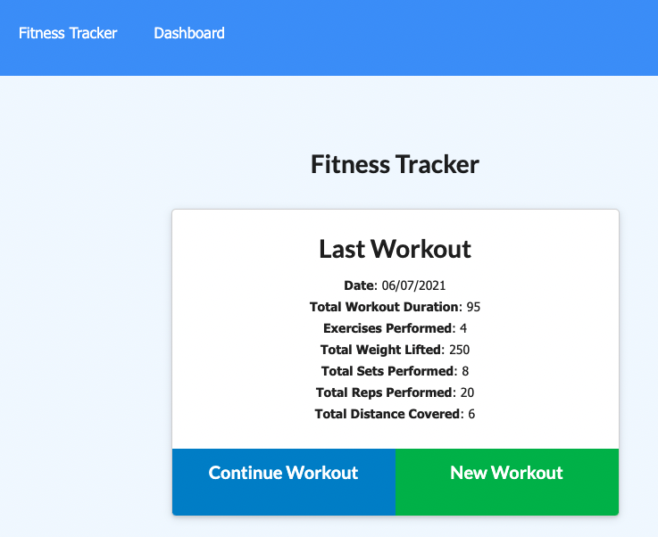
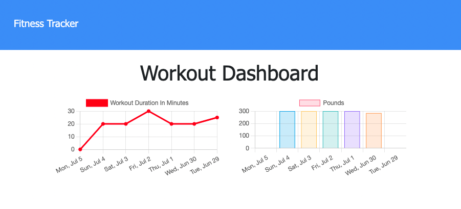

# workout-tracker
Front end code was provided for a Workout Tracker app.  Back end code was then added to ensure a fully functional app utilising Mongo DB and hosted on Heroku.  

## Description & LIVE DEPLOYED WEBSITE
---
The app can be viewed live [here](https://workout-tracker-co.herokuapp.com/).  
This workout tracker app allows the user to enter their workout details and then calculates daily totals which are displayed in a dashboard.  The user can choose whether to enter a cardio or resistance style workout, and then include details such as duration, distance and weights.    

## Screenshots
---
The following images show the web application's appearance and functionality: 
The data that is shown for the last workout, once exercises are added. 

THe Dashboard showing the last 7 workouts by duration and pounds lifted

## Tools & Technologies
---
    - express
    - mongoose
    - mongodb
    - dotenv to hide personal data
    - As suggested in the assignment guide I used the aggregate, $sum, and $addfields operators in order to calculate the totals.  

## Installation
---
Step 1 - Clone the github repo

Step 2 - Enter your mongodb_uri in the EXAMPLE .env file and save as .env

Step 3 - Right click the server.js file and `Open in intergrated Terminal`, and run `npm install` to install dependancies

Step 4 - Enter `npm run seed` to seed the test data into the database

Step 5 - Enter `npm start` to open the server connection

Step 6 - Open your browser and enter`localhost:3000`

## Questions?
---
If you have any questions about this project, please contact me directly on [email](mailto:catormerod@gmail.com). You can view more of my projects at [Github](https://github.com/catormerod) or this specific project at [workout-tracker](https://github.com/CatOrmerod/workout-tracker). 

The app can be viewed live [here](https://workout-tracker-co.herokuapp.com/). 